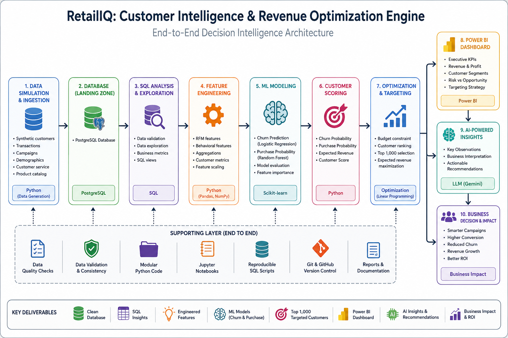
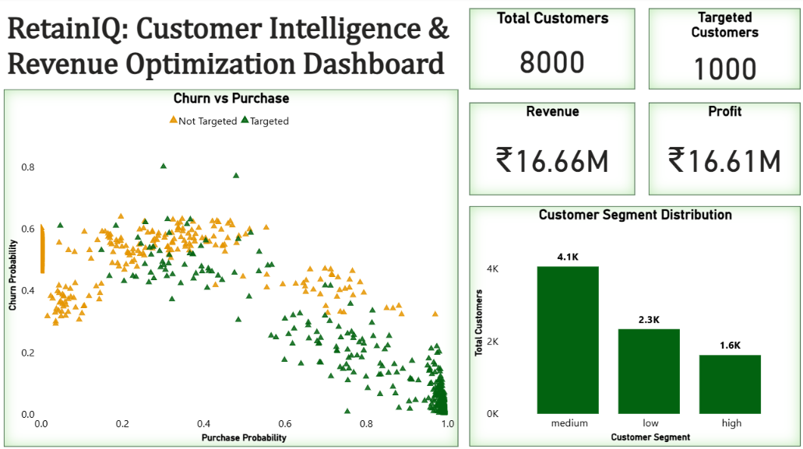

# RetailIQ — Customer Intelligence & Revenue Optimization Engine

<p align="center">
  <strong>Predict customer behavior. Prioritize the right customers. Optimize limited marketing budgets.</strong>
</p>

<p align="center">
  An end-to-end customer intelligence and decision-optimization system combining SQL, machine learning, customer segmentation, constrained targeting, business intelligence, and an AI-powered insights layer.
</p>

<p align="center">


</p>

---

## 📑 Table of Contents

- [🎯 Executive Overview](#-executive-overview)
- [🔍 Business Problem](#-business-problem)
- [💡 Solution](#-solution)
- [🏗️ System Architecture](#️-system-architecture)
- [🔄 End-to-End Pipeline](#-end-to-end-pipeline)
- [📊 Data Design](#-data-design)
- [🧹 Data Engineering](#-data-engineering)
- [👥 Customer Intelligence](#-customer-intelligence)
- [🧠 Feature Engineering](#-feature-engineering)
- [🤖 Predictive Modeling](#-predictive-modeling)
- [🎯 Customer Targeting & Optimization](#-customer-targeting--optimization)
- [💰 Business Impact](#-business-impact)
- [📊 Power BI Dashboard](#-power-bi-dashboard)
- [🤖 AI-Powered Business Insights](#-ai-powered-business-insights)
- [🔎 Key Business Insights](#-key-business-insights)
- [🧪 Reliability & Decision Quality](#-reliability--decision-quality)
- [🛠️ Tech Stack](#️-tech-stack)
- [📁 Project Structure](#-project-structure)
- [⚙️ How to Run](#️-how-to-run)
- [📈 Results & Interpretation](#-results--interpretation)
- [🚀 Future Improvements](#-future-improvements)
- [💼 Recruiter / Placement Snapshot](#-recruiter--placement-snapshot)
- [📌 Project Takeaways](#-project-takeaways)
- [👨‍💻 Connect](#-connect)
- [📄 License](#-license)

---

## 🎯 Executive Overview

**RetailIQ** is an end-to-end **Customer Intelligence & Revenue Optimization Engine** designed around a practical business question:

> **Given a limited marketing budget, which customers should the business target to maximize expected revenue while reducing campaign waste?**

Instead of stopping at customer analytics or model predictions, the project connects the complete decision chain:

**Customer Data → SQL Analytics → Behavioral Features → Churn & Purchase Prediction → Customer Ranking → Budget-Constrained Targeting → Revenue Estimation → BI Dashboard → AI Business Recommendations**

The system is designed to demonstrate how a data science workflow can translate into an actionable **customer-level business decision**.

### What the system does

- Builds a behavior-driven customer dataset
- Stores and analyzes data using PostgreSQL
- Performs SQL-based validation, exploration, and feature engineering
- Creates RFM and engagement features
- Identifies customer value segments
- Predicts **churn probability**
- Predicts **future purchase probability**
- Combines predictive signals to prioritize customers
- Applies a marketing budget constraint
- Selects the **top 1,000 customers** for targeting
- Estimates campaign revenue, cost, and profit
- Provides a Power BI decision dashboard
- Converts model outputs into business recommendations through an AI insight layer
- Includes deterministic fallback logic when external LLM endpoints are unavailable

---

## 🔍 Business Problem

Marketing teams rarely have unlimited budget or equal-value customers.

The project addresses three connected problems:

### 1. Customer value is uneven

Some customers generate substantially more commercial value than others. Treating every customer identically can result in inefficient campaign allocation.

### 2. Customer behavior is uncertain

A customer may:

- become inactive,
- churn,
- purchase again,
- respond to a campaign,
- or remain engaged without immediate purchase.

Predictive modeling can help estimate these outcomes.

### 3. Marketing resources are constrained

Even if a business identifies thousands of potentially valuable customers, it may only have the budget to contact a smaller subset.

Therefore, the real problem is not simply:

> **"Who is likely to churn?"**

or

> **"Who is likely to purchase?"**

It is:

> **"Who should we target given the available budget and expected business value?"**

---

## 💡 Solution

RetailIQ follows a decision-oriented architecture.

### Decision flow

1. **Generate / ingest customer data**
2. **Validate and analyze data using SQL**
3. **Create customer-level behavioral features**
4. **Segment customers by value and behavior**
5. **Train churn and purchase-probability models**
6. **Score customers**
7. **Rank customers using expected business value**
8. **Apply the campaign budget constraint**
9. **Select the highest-priority customers**
10. **Estimate revenue, campaign cost, and net profit**
11. **Visualize decisions in Power BI**
12. **Generate business recommendations using the AI insights layer**

This turns a conventional ML pipeline into a **decision-support system**.

---

## 🏗️ System Architecture



### Architecture layers

```text
┌───────────────────────────────────────────────┐
│              CUSTOMER DATA LAYER              │
│ Customers • Products • Transactions • Events │
└───────────────────────┬───────────────────────┘
                        │
                        ▼
┌───────────────────────────────────────────────┐
│            DATA ENGINEERING / SQL             │
│ Validation • Exploration • Aggregation       │
│ RFM • Engagement • Behavioral Features       │
└───────────────────────┬───────────────────────┘
                        │
                        ▼
┌───────────────────────────────────────────────┐
│             CUSTOMER INTELLIGENCE             │
│ Value Segmentation • RFM • Behavior Analysis │
└───────────────────────┬───────────────────────┘
                        │
                        ▼
┌───────────────────────────────────────────────┐
│                ML SCORING                     │
│ Churn Probability • Purchase Probability     │
│ Logistic Regression • Random Forest           │
└───────────────────────┬───────────────────────┘
                        │
                        ▼
┌───────────────────────────────────────────────┐
│          TARGETING OPTIMIZATION               │
│ Expected Value • Ranking • Budget Constraint │
│              Top 1,000 Customers              │
└───────────────────────┬───────────────────────┘
                        │
              ┌─────────┴─────────┐
              ▼                   ▼
┌──────────────────────┐  ┌────────────────────┐
│     POWER BI         │  │   AI INSIGHTS      │
│ KPIs • Segments      │  │ Observations       │
│ Revenue • Targeting  │  │ Interpretation      │
│ Opportunity View     │  │ Recommendations     │
└──────────────────────┘  └────────────────────┘
```

---

## 🔄 End-to-End Pipeline

```text
Data Generation
      ↓
PostgreSQL Database
      ↓
Data Validation
      ↓
SQL Exploration
      ↓
RFM + Engagement Features
      ↓
Customer Segmentation
      ↓
Churn Model ───────────────┐
                           ├──→ Customer Scoring
Purchase Probability Model ┘
                           ↓
                    Expected Value
                           ↓
                 Budget-Constrained
                    Target Selection
                           ↓
              Revenue / Cost / Profit
                           ↓
              ┌────────────┴────────────┐
              ↓                         ↓
        Power BI Dashboard       AI Insights Layer
```

---

## 📊 Data Design

The project uses a **synthetic but behavior-driven dataset** designed to reproduce realistic customer analytics conditions.

### Core entities

| Entity | Purpose |
|---|---|
| `customers` | Customer-level demographic/value information |
| `products` | Product catalog information |
| `transactions` | Historical purchase activity |
| `interactions` | Customer engagement/activity signals |

### Behavioral characteristics included

- Customer value differences
- High / Medium / Low value segments
- Purchase behavior
- Customer interactions
- Engagement variation
- Churn signals
- Missing values
- Noise and realistic variability

### Why synthetic data?

The objective is to demonstrate the **analytical and decision architecture** without exposing private customer information.

The data-generation layer is also reproducible and makes the project easier to run independently.

---

## 🧹 Data Engineering

PostgreSQL is used as the analytical database layer.

### SQL responsibilities

- Database setup
- Data validation
- Data exploration
- Customer-level aggregation
- RFM feature creation
- Engagement feature creation
- Behavioral analysis

### Data engineering flow

```text
Raw CSV Data
     ↓
PostgreSQL
     ↓
Validation
     ↓
SQL Transformations
     ↓
Customer Feature Tables
     ↓
Modeling Dataset
     ↓
Scoring Output
```

This demonstrates the ability to move between **Python-based analytics and SQL-based data engineering** rather than relying exclusively on notebooks.

---

## 👥 Customer Intelligence

The project converts transaction and interaction history into customer-level intelligence.

### RFM Analysis

The classic **RFM framework** is used:

- **Recency** — How recently did the customer purchase?
- **Frequency** — How frequently does the customer purchase?
- **Monetary** — How much value does the customer generate?

### Engagement Intelligence

Additional behavioral signals include:

- Customer interactions
- Interaction-to-purchase ratio
- Activity/inactivity signals
- Purchase behavior
- Customer value category

### Customer segmentation

Customers are categorized into:

- **High Value**
- **Medium Value**
- **Low Value**

The segmentation provides a business layer above the raw model scores.

---

## 🧠 Feature Engineering

The feature layer combines transactional, engagement, and behavioral information.

### Core features

| Feature Group | Examples |
|---|---|
| RFM | Recency, Frequency, Monetary |
| Engagement | Interaction activity |
| Conversion | Interaction-to-purchase ratio |
| Behavioral | Purchase and inactivity signals |
| Value | Customer value segment |
| Targeting | Churn / purchase model scores |

The objective is to create features that are not only predictive but also **interpretable to business stakeholders**.

---

## 🤖 Predictive Modeling

Two predictive tasks are implemented.

### 1. Churn Prediction

**Objective:** estimate the probability that a customer is at risk of leaving / becoming inactive.

### 2. Purchase Probability

**Objective:** estimate the likelihood that a customer will make a future purchase.

### Models

| Model | Purpose |
|---|---|
| Logistic Regression | Interpretable baseline |
| Random Forest | Non-linear predictive model |

The project intentionally balances:

- Predictive usefulness
- Interpretability
- Business relevance
- Operational simplicity

### Why use multiple models?

A single model does not automatically provide the best business decision.

The comparison allows the pipeline to consider both:

> **"How well can we predict?"**

and

> **"Can the result be understood and used by the business?"**

---

## 🎯 Customer Targeting & Optimization

This is the core decision layer of RetailIQ.

The system does not simply output probabilities. It uses those probabilities to create a **targeting strategy**.

### Targeting logic

Customer scores combine:

- Churn risk
- Purchase probability
- Customer value
- Expected business opportunity

The resulting customers are ranked according to expected value.

### Budget constraint

The optimization layer then applies the available campaign constraint and selects:

> **Top 1,000 customers for targeting**

This makes the project closer to a real-world marketing decision system than a standalone classification exercise.

### Conceptual decision objective

```text
Maximize:
    Expected Campaign Revenue

Subject to:
    Campaign Cost ≤ Available Budget

Decision:
    Select highest-value customers
```

---

## 💰 Business Impact

The current project scenario produces the following targeting economics:

| Metric | Result |
|---|---:|
| Total Customers | **8,000** |
| Targeted Customers | **1,000** |
| Expected Revenue | **₹16.66M** |
| Campaign Cost | **₹50K** |
| Net Profit | **₹16.61M** |

### Business interpretation

The scenario illustrates how customer intelligence can concentrate marketing resources on a smaller group of customers with higher expected value.

> **Key takeaway:** a small subset of customers can account for a disproportionate share of expected revenue, making intelligent targeting more efficient than uniform outreach.

**Important:** these are scenario-level results from the project's synthetic, behavior-driven dataset; they should not be interpreted as production-company financial results.

---

## 📊 Power BI Dashboard

The project includes a decision-focused Power BI dashboard.



### Dashboard objectives

The dashboard is designed to answer:

- How much revenue is being generated?
- How much profit is expected?
- How many customers are being targeted?
- How are customers distributed across value segments?
- Which customers represent the best targeting opportunities?
- How does customer risk differ across segments?

### Executive KPI layer

The dashboard highlights:

- Revenue
- Profit
- Targeted customers
- Customer segments
- Targeting opportunities

### Decision view

The dashboard connects model outputs with business context instead of presenting model metrics in isolation.

---

## 🤖 AI-Powered Business Insights

Predictive models generate scores, but business stakeholders generally need **interpretation and recommended actions**.

RetailIQ therefore includes a lightweight AI interpretation layer.

### Objective

Convert structured analytical outputs into:

1. **Key observations**
2. **Business interpretation**
3. **Actionable recommendations**

### Input to the AI layer

Instead of sending raw customer records, the system provides curated business metrics such as:

- Segment churn rates
- Purchase probabilities
- Targeting metrics
- Campaign revenue
- Campaign cost
- Campaign profit

This reduces unnecessary data exposure and keeps the AI layer focused on business-level interpretation.

### Multi-model fallback

The AI integration uses **OpenRouter** with multiple model options.

If external models fail or are unavailable, the system switches to a:

> **Deterministic fallback insight generator**

This provides:

- Robustness
- Consistent output
- Graceful degradation
- Reduced dependence on a single external model endpoint

### Decision-intelligence principle

```text
Raw Data
   ↓
ML Predictions
   ↓
Business Metrics
   ↓
AI Interpretation
   ↓
Recommended Action
```

The AI layer therefore complements—not replaces—the analytical pipeline.

---

## 🔎 Key Business Insights

The current analysis highlights several patterns:

### 1. Customer value is highly uneven

High-value customers represent a strategically important portion of the customer base.

### 2. Engagement matters

Higher engagement is associated with stronger purchase behavior in the simulated customer population.

### 3. Inactivity is an important churn signal

Reduced activity can indicate increased churn risk.

### 4. Targeting should be selective

When marketing resources are constrained, targeting the highest-value opportunities is preferable to treating all customers equally.

### 5. Acquisition and retention should be separated

A customer with high purchase probability may be a strong revenue-growth target, while a high-churn customer may require a different retention strategy.

This distinction prevents the business from using one generic campaign for every customer.

---

## 🧪 Reliability & Decision Quality

The project emphasizes reliability at the decision layer.

### External AI reliability

The AI insight generator includes deterministic fallback behavior so that a temporary external model/API failure does not break the business-insight workflow.

### Interpretability

The system uses:

- RFM features
- Engagement metrics
- Logistic Regression
- Random Forest
- Explicit targeting logic
- Business-level KPIs

This makes the pipeline easier to explain during stakeholder review or an interview.

### Data privacy principle

The AI layer is designed around **curated business metrics rather than raw customer records**, reducing unnecessary exposure of individual-level data to an external LLM service.

---

## 🛠️ Tech Stack

### Programming & Analytics

- **Python**
- Pandas
- NumPy
- Scikit-learn
- Matplotlib
- Seaborn
- Requests

### Database

- **PostgreSQL**
- SQL

### Machine Learning

- Logistic Regression
- Random Forest
- Customer scoring
- Behavioral segmentation

### Business Intelligence

- **Power BI**
- PowerPoint

### AI Integration

- OpenRouter
- Multi-model fallback
- Deterministic fallback insight generation

### Engineering & Version Control

- Git
- GitHub
- Joblib

---

## 📁 Project Structure

```text
customer-intelligence-revenue-optimization/
│
├── data/
│   ├── raw/
│   │   ├── customers.csv
│   │   ├── products.csv
│   │   ├── transactions.csv
│   │   └── interactions.csv
│   │
│   └── processed/
│       ├── customer_features.csv
│       ├── dashboard_dataset.csv
│       ├── modeling_dataset.csv
│       └── scoring_output.csv
│
├── notebooks/
│   ├── 01_data_generation.ipynb
│   ├── 02_eda.ipynb
│   ├── 03_modeling.ipynb
│   └── 04_optimization.ipynb
│
├── sql/
│   ├── 01_database_setup.sql
│   ├── 02_data_validation.sql
│   ├── 03_data_exploration.sql
│   └── 04_feature_engineering.sql
│
├── models/
│   ├── churn_model.joblib
│   ├── churn_scaler.joblib
│   ├── purchase_drop_cols.joblib
│   ├── purchase_model.joblib
│   └── purchase_scaler.joblib
│
├── src/
│   ├── data_generation.py
│   ├── feature_engineering.py
│   ├── fix_scoring_ids.py
│   ├── modeling.py
│   ├── optimization.py
│   └── ai_integration.py
│
├── images/
│   ├── architecture.png
│   └── dashboard.png
│
└── reports/
    ├── crros_dashboard.pbix
    ├── crros_dashboard_static.pdf
    ├── crros_presentation.pptx
    └── crros_presentation_static.pdf
```

---

## ⚙️ How to Run

### 1. Clone the repository

```bash
git clone https://github.com/abhi-iitg/customer-intelligence-revenue-optimization.git
cd customer-intelligence-revenue-optimization
```

### 2. Create a Python environment

```bash
python -m venv .venv
```

Activate it on Windows:

```bash
.venv\Scripts\activate
```

Activate it on macOS/Linux:

```bash
source .venv/bin/activate
```

### 3. Install dependencies

If a `requirements.txt` file is present in the repository:

```bash
pip install -r requirements.txt
```

Otherwise install the libraries used by the project:

```bash
pip install pandas numpy scikit-learn matplotlib seaborn requests joblib
```

### 4. Configure PostgreSQL

Create a PostgreSQL database and run:

```text
sql/01_database_setup.sql
```

Then execute the validation and analytical SQL scripts:

```text
sql/02_data_validation.sql
sql/03_data_exploration.sql
sql/04_feature_engineering.sql
```

### 5. Generate / process the dataset

Run the data-generation and feature-engineering workflow:

```text
src/data_generation.py
src/feature_engineering.py
```

### 6. Train the models

Run:

```text
notebooks/03_modeling.ipynb
```

This produces customer-level predictive scores for churn and purchase probability.

### 7. Run optimization

Run:

```text
notebooks/04_optimization.ipynb
```

This ranks customers and applies the campaign targeting constraint.

### 8. Open the dashboard

Open:

```text
reports/crros_dashboard.pbix
```

in Microsoft Power BI Desktop.

---

## 📈 Results & Interpretation

### Customer-level decision framework

RetailIQ separates the customer decision into multiple dimensions:

| Dimension | Question |
|---|---|
| Value | How commercially important is the customer? |
| Engagement | How active is the customer? |
| Churn | How likely is the customer to become inactive? |
| Purchase | How likely is the customer to purchase? |
| Economics | What is the expected value of targeting them? |
| Constraint | Can the business afford to target them? |

This produces a more useful decision framework than using a single ML probability.

### Example targeting interpretation

```text
High Purchase Probability
        +
High Customer Value
        +
Acceptable Campaign Cost
        ↓
   HIGH PRIORITY
```

While:

```text
High Churn Risk
        +
Low Purchase Probability
        ↓
Retention / Re-engagement Strategy
```

The project therefore supports different actions for different customer states.

---

## 🚀 Future Improvements

The current implementation can be extended into a more production-grade customer decision platform.

### Modeling

- Gradient Boosting / XGBoost
- LightGBM
- Calibrated probability models
- Survival analysis for time-to-churn
- Customer Lifetime Value prediction
- Uplift modeling / treatment-effect estimation

### Optimization

- Integer programming
- Campaign-level budget allocation
- Channel-specific costs
- Contact-frequency constraints
- Expected incremental revenue rather than raw predicted revenue

### Experimentation

- A/B testing
- Holdout/control groups
- Incrementality measurement
- Campaign-level causal analysis

### Engineering

- Automated ETL pipelines
- Data quality checks
- Model monitoring
- Feature stores
- Batch scoring pipelines
- API-based inference
- CI/CD

### Product / Decision Layer

- Interactive customer-level recommendations
- Campaign simulation
- What-if budget analysis
- Retention-vs-acquisition trade-off analysis
- Automated executive reporting

---

## 💼 Recruiter / Placement Snapshot

### What this project demonstrates

| Area | Demonstrated Skill |
|---|---|
| Business Analytics | Customer value and revenue analysis |
| SQL | PostgreSQL data validation and feature engineering |
| Data Science | Behavioral feature engineering |
| Machine Learning | Churn and purchase prediction |
| Customer Analytics | RFM and segmentation |
| Optimization | Budget-constrained targeting |
| Business Intelligence | Power BI dashboard |
| AI | LLM-based business interpretation |
| Decision Science | Prediction → action framework |
| Engineering | Modular Python + SQL project structure |

### Strong interview talking points

**1. Why not target every customer?**  
Because marketing resources are constrained, so the system prioritizes customers by expected business value.

**2. Why predict both churn and purchase probability?**  
Because acquisition/growth and retention are different business decisions. Combining both signals provides richer customer intelligence.

**3. Why use SQL and Python together?**  
SQL is effective for structured aggregation and database-level transformation, while Python provides flexible modeling and optimization capabilities.

**4. Why include a deterministic AI fallback?**  
Because a business workflow should degrade gracefully when an external LLM endpoint becomes unavailable.

**5. What is the key business output?**  
Not merely a model probability—the key output is a ranked customer targeting decision under a budget constraint.

---

## 📌 Project Takeaways

RetailIQ demonstrates a complete transition:

```text
Data
 ↓
Information
 ↓
Customer Intelligence
 ↓
Prediction
 ↓
Optimization
 ↓
Business Decision
 ↓
Actionable Insight
```

The central principle is:

> **A good data science system should not stop at predicting what may happen. It should help the business decide what to do next.**

---

## 👨‍💻 Connect

**Abhishek Kumar Gond**  
B.Tech — Chemical Engineering, IIT Guwahati

- **GitHub:** [abhi-iitg](https://github.com/abhi-iitg)
- **LinkedIn:** [Abhishek Kumar Gond](https://www.linkedin.com/in/abhishekkumargond/)
- **Portfolio:** [Abhishek's Portfolio](https://abhishek-kg-portfolio-pied.vercel.app/)
- **Email:** mr.abhishekaaa@gmail.com

If this project is useful, consider giving the repository a ⭐.

---

## 📄 License

This project is licensed under the **MIT License**.

See the [`LICENSE`](LICENSE) file for details.

---

<p align="center">
  <strong>RetailIQ — From Customer Data to Revenue Decisions.</strong>
</p>
